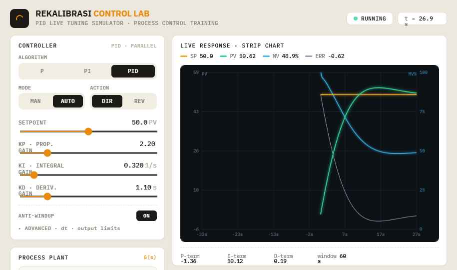

# Rekalibrasi Control Lab — PID Tuning Simulator

A real-time, browser-based **PID controller tuning simulator** for process-control
education and engineering training. Tune `Kp / Ki / Kd` against configurable plant
models and watch the live strip chart respond — overshoot, settling, windup, dead
time, sensor noise, actuator saturation, and auto-tuning rules, all in real time.
Dependency-free single static page.

> A companion **closed-loop process simulator** (Control-Sim) — the same loop rebuilt
> from industrial instrument blocks with an engineering-unit signal chain — is
> developed in its own separate repository.



## What it does

- **Controllers** — P, PI, PID (parallel form) with manual/auto modes, direct/reverse
  action, derivative filtering, and back-calculation anti-windup.
- **Plant models** — first order, FOPDT (with dead time), second order (ωn / ζ),
  SOPDT, and integrating processes.
- **Real-time strip chart** — SP, PV, MV, and error traces on a dual-axis canvas
  scope with a configurable time window and an interactive snapshot (before/after)
  ghost trace.
- **Disturbances** — step/pulse load disturbances, Gaussian sensor noise, and an
  actuator slew-rate limit.
- **Performance metrics** — overshoot, rise/peak/settling time, steady-state error,
  control effort, IAE / ISE / ITAE, computed live.
- **Auto-tuning lab** — Ziegler–Nichols (open loop), Cohen–Coon, and IMC (lambda)
  rules from an identified FOPDT model.
- **Export** — full run history + configuration + metrics as JSON or CSV.
- **Dark / light themes** — a control-room HMI dark theme and a light instrument
  theme, toggled from the header and remembered across visits (defaults to your
  OS preference). Readable typography: sans-serif labels with monospace digit
  readouts.

**Keyboard shortcuts:** `Space` / `K` — start · pause · resume · `R` — reset to READY ·
`S` — single step. (Ignored while typing in a field.)

The render loop is `requestAnimationFrame`-driven, so it caps redraws at the display
refresh rate, fully pauses when the browser tab is hidden, and does no work while the
sim is paused and idle.

> ⚠️ **Safety** — This simulator is for education, conceptual design, research, and
> training only. Generated tuning parameters must **not** be applied directly to real
> industrial processes without proper hazard analysis, field validation, and review
> by qualified control engineers.

## Run locally

It's a static page with **no build step and no dependencies**. Open it directly:

```bash
# simplest — just open the file
open index.html        # macOS  (use xdg-open on Linux, start on Windows)

# or serve it (any static server works)
python3 -m http.server 8000
# then visit http://localhost:8000
```

## Deploy to the web

Because the app is a dependency-free static bundle (`index.html` + `app.js`), it can
be hosted anywhere that serves static files.

### GitHub Pages (automated)

A workflow at `.github/workflows/deploy.yml` publishes the site on every push to
`main`. To enable it once:

1. Push this repository to GitHub.
2. Go to **Settings → Pages → Build and deployment** and set **Source** to
   **GitHub Actions**.
3. Push to `main` — the site goes live at
   `https://<user>.github.io/<repo>/`.

### Other hosts

Drag-and-drop or point any of these at the repository root:

- **Netlify / Vercel / Cloudflare Pages** — no build command, publish directory `/`.
- **Any web server / CDN / S3 bucket** — upload `index.html` and `app.js`.

The GitHub Pages workflow publishes only the app files (`index.html`, `app.js`,
`.nojekyll`) — not the repo's development assets (`design/`, `.claude/`) — so the live
site stays lean.

## Project layout

```
index.html                     App — markup, styles, layout (control-room HMI)
app.js                         Simulation + UI binding (no framework, no CDN)
.github/workflows/deploy.yml   GitHub Pages deployment (publishes app files only)
design/                        Original Design-Component (DC) source this was ported from
  Rekalibrasi Control Lab.dc.html
  ParamSlider.dc.html
  MetricStat.dc.html
  support.js
  screenshots/
```

## How it was built

The original design (`design/`) was authored as a **Design Component** — a React
template rendered by a proprietary runtime (`support.js`) that loads React from a CDN
and fetches sibling components at runtime. To make it genuinely deployable as a live
web page, the rendering layer was reimplemented with plain DOM binding while the
**simulation core was preserved verbatim** (the discrete PID step, plant integrators,
metrics, canvas scope, auto-tuning rules, and export). The result is a single static
page with zero runtime dependencies.
